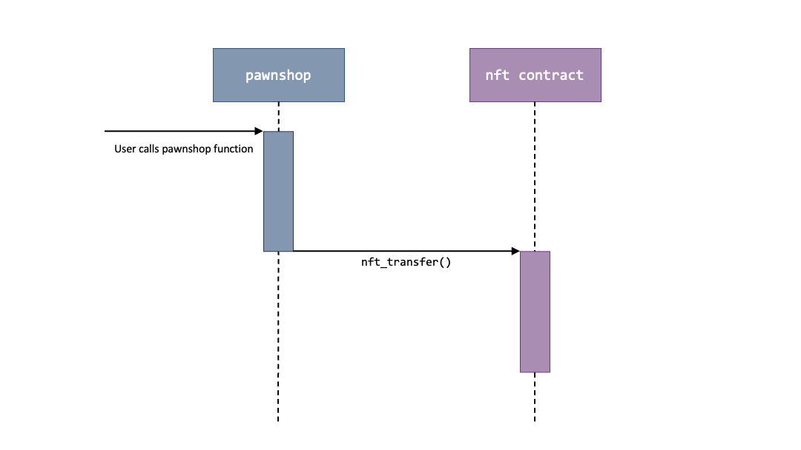
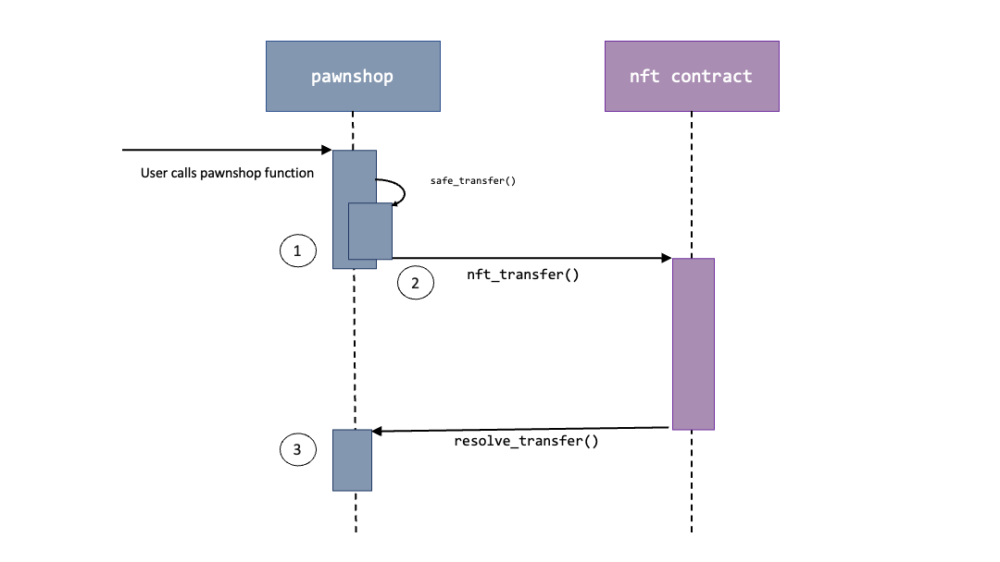
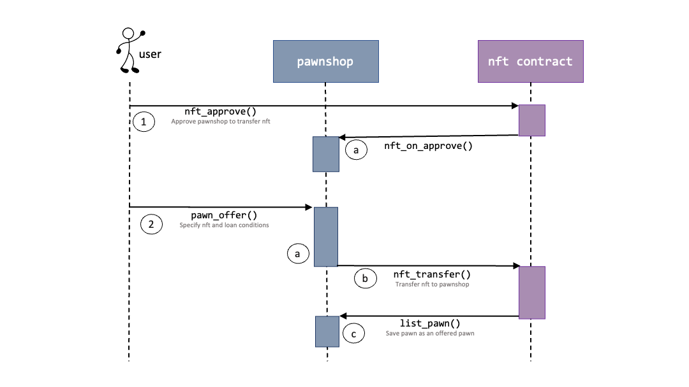

# Developer Guide

{:toc}

--------------------------------------------------------------------------------------------------------------------

## **Design**

### Contract Architecture

| File | Description |
| ------------- | ------------- |
| `lib.rs`| Holds smart contract initialisation and view functions |
| `pawn.rs`  | Defines the pawn structure  |
| `pawn_offer.rs`  | Contains pawn offering / acceptance logic and methods |
| `pawn_payment.rs`  | Contains loan repayment / defaulting logic and methods |
| `external.rs`  | Holds external callbacks the contract requires |
| `approval_receiver.rs`  | Holds approval callback that nft contracts will call |
| `transfers.rs`  | Holds logic to safely transfer nfts |
| `utils.rs`  | Holds helper functions used by other components |

### Contract State

| Property | Description |
| ------------- | ------------- |
| `offered_pawns` | Set of offered [pawns](#glossary) |
| `confirmed_pawns`  | Set of confirmed (and unresolved) pawns  |
| `by_broker_id`  | Set of pawn ids that each user has brokered |
| `by_borrower_id`  | Set of pawn ids that each user has offered |
| `pending_transfers`  | Set of all [pending transfers](#pending-transfer-structure) |

### Contract API

The contract API can be found in the [User Guide](UserGuide.html).

--------------------------------------------------------------------------------------------------------------------

## Implementation

This section covers the more non-trivial aspects of the contract's logic.

### Safely Transferring NFTs

Certain functionality requires the contract to transfer nfts via cross-contract calls. This can generally be problematic should transfers fail midway.

In the example above, should the `nft_transfer()` promise fail (e.g. due to insufficient gas), the logic that ran in the `pawnshop` method will still be finalistic. Thus, the pawnshop contract will be 'out-of-sync' with the nft contract. For example, after repaying a loan, the pawnshop contract might delete and forget its ownership of a particular nft, even thought the nft transfer back to the borrower might have failed. Without additional mechanisms, there is no way for the rightful owner to recover the nft.

To circumvent such a scenario, we implement `transfers::Contract::safe_transfer`.

`safe_transfer()` does the following:

1. Saves the transfer as a pending outgoing transfer.
2. Call nft_transfer() on the nft contract.
3. Set a callback after transfer which verifies that the transfer is successful. If so, delete the pending outgoing transfer.

This way, should the cross-contract calls fail in step 2, we still have the pending outgoing transfer. Then, users can call `retry_outgoing_transfer()` to reattempt the pending transfer (until successful). 

__Note__: Should the cross-contract fail at step 3, the pawnshop will end up with an redundant pending transfer object. But this is not as crucial as a lost nft. 

### Offering Pawns

The interaction diagram below depicts the pawn offering process.

1. The user approves the nft to be collateralised for the pawnshop to transfer.

    a.  Upon transfer, the nft contract will invoke the pawnshop's `nft_on_approve()` callback, as per NEAR's nft standards. Here,
    the pawnshop will save the nft (and owner) as an __pending incoming transfer__.

2. The user then calls pawnshop's `pawn_offer()`, specifying the collateral nft and loan conditions.

    a. The pawnshop checks that the nft has been approved for transfer.
    
    b. The pawnshop transfers the nft from owner to itself.
    
    c. After the transfer, the pawnshop verifies the transfer has succeeded, and saves the specified loan conditions as a pawn offer.

--------------------------------------------------------------------------------------------------------------------

## Proposed Features

### Monetisation and a Security Token
The contract can charge a small percentage fee for each brokered pawn. 

To bootstrap the app, the contract can implement its own fungible token where early users can earn. Staking the fungible token, token holders can earn a percentage of the contract's profits (in NEAR).

### Adding Simulation Tests

To properly test cross-contract calls, simulation tests will be required.  

Simulation tests will be added after cross-contract compilation is supported in Apple M1 chips. See [this issue](https://github.com/near/nearcore/issues/3803) for more information.

--------------------------------------------------------------------------------------------------------------------

## Appendix

### Pending Transfer Structure

`PendingTransfer` represents a pending transfer that the pawnshop can perform. Transfers are either __incoming__ (transfer to the pawnshop) or __outgoing__ (transferred from the pawnshop).

* __Incoming Transfers__. Used by the [pawn offering process](#offering-pawns).

    * __`from`__: Current owner of nft
    * __`approval_id`__: Approval_id from the nft contract

* __Incoming Transfers__. Used for [safe transfers](#safely-transferring-nfts).

    * __`from`__: Current owner of nft
    * __`approval_id`__: Approval_id from the nft contract

### Glossary

| Term | Definition |
| ------------- | ------------- |
| Borrower | A user that wishes to take a loan in NEAR |
| Broker | A user that grants the loan to a borrower |
| Pawn | An event where a borrower uses an owned nft as a collateral to take a loan from a broker, at an agreed interest rate and duration. |
| Offered Pawn | A pawn that conditions have been proposed by a borrower, but is still unaccepted by any broker. |
| Accepted / Confirmed Pawn  | A pawn that conditions have been accepted by a broker. Consequently, the broker has also transferred NEAR to the borrower.  |
| Pawn Liquidation  | Defines the pawn structure  |